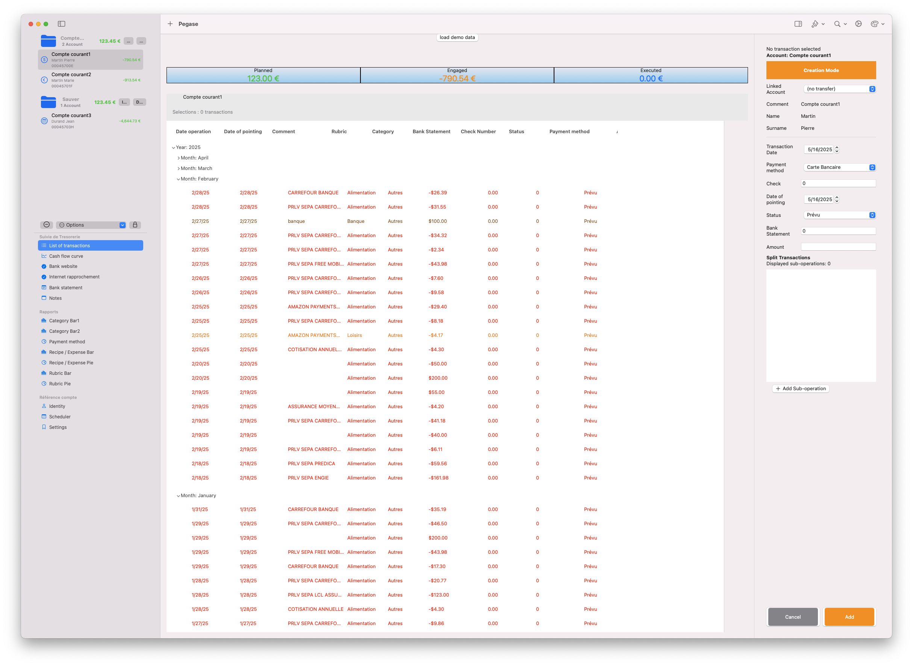
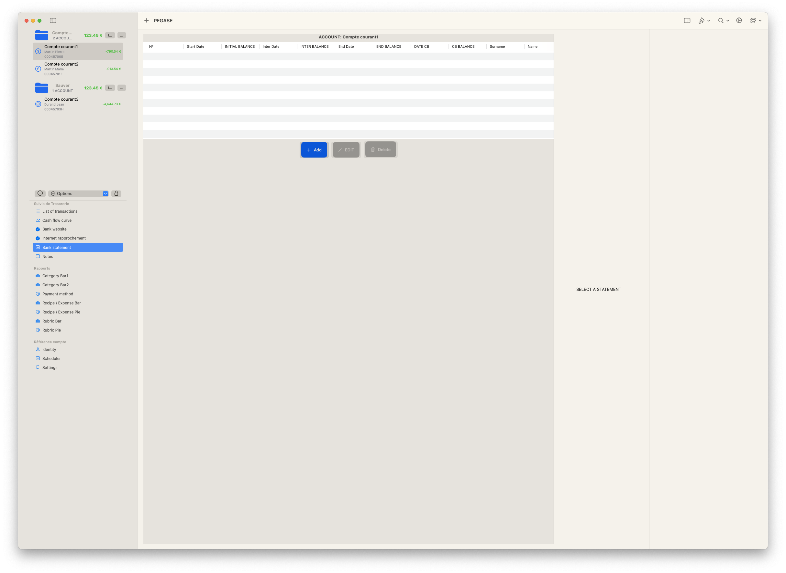
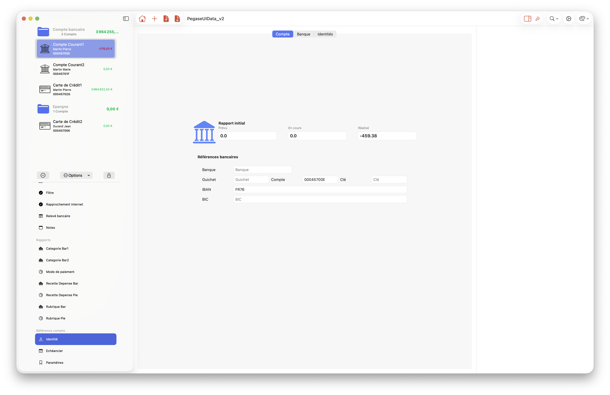

# PegaseUIData

  
    <a href="https://github.com/thierryH91200/PegaseUIData/releases/latest" alt="Downloads">
          </a>


PegaseUIData is a macOS application developed in **SwiftUI**, designed to **manage and visualize financial transactions** in an intuitive and efficient way.

## 📸 Overview


<p align="center">

<p align="center">
<em>Transactions</em>
</p>
</p>

<p align="center">

<p align="center">
<em>Bank statement</em>
</p>
</p>

<p align="center">

<p align="center">
<em>Charts</em>
</p>
</p>

<p align="center">

<p align="center">
<em>Charts</em>
</p>
</p>

## 🚀 Features

- 📅 **Organizes transactions by year and month** with dynamic grouping.
- 🔍 **Displays and manages transactions** in an interactive list.
- 🎨 **Modern and intuitive interface** built with SwiftUI.
- 📂 **Saves and restores display states** (DisclosureGroup).
- 🛠️ **Allows filtering, deleting, or viewing transaction details.**

## 📦 Installation

### 🔧 Requirements
- macOS 14+ (Sonoma)
- Xcode 15+
- Swift 5.7+

### 📥 Clone the project

```bash
git clone https://github.com/your-username/PegaseUIData.git
cd PegaseUIData
open PegaseUIData.xcodeproj
```

### ▶️ Run the application
- Open the project with **Xcode**.
- Select a simulator or a local machine.
- **Run** (⌘ + R) to launch the application.

## 📜 Usage

1. **Launch PegaseUIData** and load existing transactions.
2. **Browse transactions** organized by year and month.
3. **Use the context menu** (right-click) to view details or delete a transaction.
4. **Customize the display** using the available options.

## 🛠️ Contribution

Contributions are welcome!

1. **Fork** the project 🍴.
2. **Create a branch** (`git checkout -b feature-new-function`).
3. **Commit your changes** (`git commit -m 'Added a new feature'`).
4. **Push the branch** (`git push origin feature-new-function`).
5. **Open a Pull Request** ✅.

## 📃 License

This project is licensed under the **MIT** License. See the [LICENSE](LICENSE) file for more details.

## 🌟 Acknowledgments

Thank you for using **PegaseUIData**! If this project has helped you, **don't forget to leave a ⭐ on GitHub** 🚀.


## FAQ – Frequently Asked Questions

### Is PegaseUIData really free?

Yes. PegaseUIData is completely free and open-source. It is released under the MIT license, meaning you can use, modify, and even redistribute your own version.

### Are my data stored online?

No. All data are stored **locally on your Mac**. There is no transmission of your information to any remote server.

### Can I import my bank data?

Yes. PegaseUIData supports importing **CSV files** (and other formats to come). Make sure your file follows the expected structure (date, amount, description, etc.).

### Can I manage multiple accounts?

Yes. You can create and track as many accounts as you want (checking, savings, business, etc.).

### Can transactions be categorized automatically?

A semi-automatic categorization is available. PegaseUIData learns to recognize frequent descriptions and suggests categories. You can also modify them manually.

### Can I contribute to translation?

Yes! Translation contributions are welcome. Localization files are available in the `Resources/*.lproj` directory.

### Is there a Windows / Linux version?

No. PegaseUIData is built with SwiftUI for macOS only. A cross-platform version of PegaseUIData is not planned at this time.

If you encounter a bug, you can report it by creating an issue on the project’s GitHub page:

👉 https://github.com/thierryH91200/PegaseUIData/issues

When submitting a bug report, please provide as much detail as possible, including:
    •    Your version of macOS
    •    The steps to reproduce the issue
    •    A screenshot (if applicable)

This information helps us identify and resolve the problem more efficiently.


## Stargazers over time
[](https://starchart.cc/thierryH91200/PegaseUIData)


